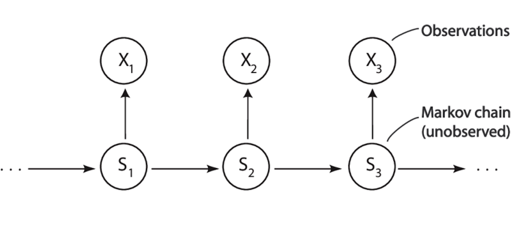

## Load essential libraries

```{r setup}
library(tidyverse)
library(wehoop)
library(msm)
```

## Load in 2022-2024 data from wehoop package

```{r}
season_years <- c(2022:2024)
pbp_data <- load_wnba_pbp(seasons = season_years)
```

## Filter down data to only shots from regular and post-season

The Las Vegas Aces won the championship in 2022. The Las Vegas Aces won the championship in 2023. The New York Liberty won the championship in 2024. These are the teams we are interested in investigating, but I am open to looking at other teams too. How does including all teams vs. including only winning teams in the data play out?

```{r}
shot_data <- pbp_data |>
  filter(shooting_play == TRUE,
         str_detect(type_text, "Free Throw") == FALSE,
         season_type %in% c(2, 3),
         # remove for-fun teams: Team Stewart, Team Wilson, Team USA, etc
         !team_id %in% c(112530, 126287, 97, 96),
         team_id %in% c(17, 9)) |>
         # LV Aces team ID = 17, NY Liberty team ID = 9
  mutate(athlete_id_1 = as.factor(athlete_id_1),
         type_text = as.factor(type_text),
         time_elapsed = 2400 - end_game_seconds_remaining) |>
  arrange(game_date)
```

How to define state behaviors? Like for the transmission probabilities?

Original paper uses games as observational units. Why not offensive possessions or shots?

Does using games as observational units mean we can only use game-level variables, like total shots per game per team?

## Aims:

1.  To determine what offensive factors might lead to hot/cold states
2.  To determine where the hot/cold streaks may have occurred, and how often
3.  Determine average length of being in each state. From my understanding, this should just be the long-run marginal probabilities if there is a stationary distribution

{width="673"}

Latent states $S$: ideally, hot and cold, maybe baseline average as well (2-3 states)

Observations $X_{ij}$: either games or shots

Initial distribution $\alpha$: this is going to be the probability of starting in either state. This should be unknown.

Transition probabilities $p_{ij}$: this is going to be a function of covariates, which are either game-level or shot-level. Let MHMMBayes do heavy lifting?

Transition matrix $P$: this is going to contain transition probabilities.

Each team is going to have a separate transition matrix and initial distribution (most likely)

How it plays out in my head: We find hidden states hot/cold using observations, which are either shots or games. The probabilities given in the initial distribution are naive. The probabilities given in the transition matrix are determined by game- or shot-level covariates. How do limiting distributions come into play? Is this something I should let MHMMBayes handle? Still don't really understand the Bayesian part of it.

Notes: maybe start without covariates for emission probability, treat as a missing data problem. Only look at shot sequences, be able to use that to see if hot or cold.

Maybe look at regularized transition probabilities since the probability of staying in the same state is gonna be high if time is discrete.

Figure out what the observed "states" are: shot attempts, shot makes? shot miss/shot make/no shot?

## Current vs. next shot distance

Here I inspect whether there seems to be any sort of linear relationship between the current and next shot distance. There does appear to be one. Then by extension there should be some relationship between probability of making the last shot and the distance to the next shot.

```{r}
shot_data |>
  mutate(shot_dist = sqrt((coordinate_x_raw^2)+(coordinate_y_raw^2)),
           last_shot_dist = lag(sqrt((coordinate_x_raw^2)+(coordinate_y_raw^2))),
         diff_dist = shot_dist - last_shot_dist,
         last_made = lag(scoring_play)) |>
  ggplot(aes(x = last_shot_dist, y = diff_dist)) + geom_point() + geom_smooth(method = "loess") + labs(title = "Difference in distance from current to last shot \n as a function of the previous shot distance", x = "Previous shot distance", y = "Current minus last shot distance (positive = further)")

shot_data |>
  mutate(shot_dist = sqrt((coordinate_x_raw^2)+(coordinate_y_raw^2)),
           last_shot_dist = lag(sqrt((coordinate_x_raw^2)+(coordinate_y_raw^2))),
         diff_dist = shot_dist - last_shot_dist,
         last_made = lag(scoring_play)) |>
  ggplot(aes(x = last_shot_dist, y = shot_dist)) + geom_point() + geom_smooth(method = "loess") + labs(title = "Difference in distance from current to last shot \n as a function of the previous shot distance", x = "Previous shot distance", y = "Current minus last shot distance (positive = further)")

shot_data |>
  mutate(shot_dist = sqrt((coordinate_x_raw^2)+(coordinate_y_raw^2)),
           last_shot_dist = lag(sqrt((coordinate_x_raw^2)+(coordinate_y_raw^2))),
         diff_dist = shot_dist - last_shot_dist,
         last_made = as.numeric(lag(scoring_play))) |>
  filter(is.na(last_made) != TRUE) |>
  ggplot(aes(x = diff_dist, y = last_made)) + geom_point() + stat_smooth(method = "glm", 
              method.args = list(family = binomial), 
              se = FALSE) + labs(title = "Difference in shot distance \n as a function of whether last shot was made", y = "Last shot made? 1 = yes, 0 = no", x = "Current minus last shot distance (positive = further)")

p <- shot_data |>
  mutate(shot_dist = sqrt((coordinate_x_raw^2)+(coordinate_y_raw^2)),
           last_shot_dist = lag(sqrt((coordinate_x_raw^2)+(coordinate_y_raw^2))),
         diff_dist = shot_dist - last_shot_dist,
         last_made = as.numeric(lag(scoring_play))) |>
  filter(is.na(last_made) != TRUE,
         team_id == 17) |>
  ggplot(aes(x = diff_dist)) + geom_histogram(bins = 100) + labs(title = "Difference in distance from last to current shot", subtitle = "0 = last shot was a miss, 1 = last shot was made", x = "Current shot distance - previous shot distance (ft)", y = "Frequency")

p + facet_wrap(vars(last_made))

```

## Discretize Time

Here I want to discretize the time in my data.

```{r}

# do this for one team for one year
game_time_score <- shot_data |>
  filter(team_id == 17,
         season == 2022) |>
  select(game_id, time_elapsed, score_value)

discrete_times <- game_time_score |>
  select(game_id, time_elapsed) |>
  group_by(game_id) |>
  summarize(max_time = max(time_elapsed)) |>
  rowwise() |>
  mutate(time_elapsed = list(0:max_time)) |>
  unnest(time_elapsed)

df_discrete <- discrete_times |>
  select(!max_time) |>
  left_join(game_time_score,
            by = join_by(game_id, time_elapsed)) |>
  mutate(event = case_when(score_value == 0 ~ 2,
                           score_value %in% c(2, 3) ~ 3)) |>
  # sanity check: do values in events and score_value match up?
   replace_na(list(event = 1)) |>
  # sanity check: do values in events and score_value match up?
   select(!score_value)
```

## Look at state transition matrix

```{r}
# this is for one season for one team. Here, state 1 is defined as no shots being taken, so of course most of the transitions are nothing happening --> nothing happening
statetable.msm(event, game_id, data = df_discrete)

# let's try the nondiscretized data.
lv_2022 <- shot_data |>
  filter(team_id == 17,
         season == 2022) |>
  mutate(event = case_when(
    score_value == 0 ~ 1,
    score_value == 2 ~ 2,
    score_value == 3 ~ 3
  ))

# gives a state table for a season
statetable.msm(event, game_id, data = lv_2022)

lv_2022_alt <- shot_data |>
  filter(team_id == 17,
         season == 2022) |>
  mutate(event = case_when(
    score_value == 0 ~ 1,
    score_value %in% c(2, 3) ~ 2
  ))

statetable.msm(event, game_id, data = lv_2022_alt)
```

This makes way more sense. This is saying within a game, how many times this season did we see a transition from state i –\> state j.

## Build the desired datasets

```{r}
build_data_3states <- function(df, team, season){
  shot_data |>
    filter(team_id == team,
           season == season,
           qtr <= 4) |>
    mutate(event = as.integer(case_when(
       score_value == 0 ~ 1,
    score_value == 2 ~ 2,
    score_value == 3 ~ 3
    ))) |>
    # CHANGED TO GAME_PLAY_NUMBER BECAUSE THESE ARE NON-OVERLAPPING
    select(game_id, time_elapsed, event) |>
    group_by(game_id, time_elapsed) |>
  mutate(dup_in_game = n() > 1, time_elapsed_adj = time_elapsed + (row_number() - 1) * 0.1)|>
  ungroup() |>
    select(-c(time_elapsed, dup_in_game)) |>
    rename(time_elapsed = time_elapsed_adj)
}

build_data_2states <- function(df, team, season){
  shot_data |>
    filter(team_id == team,
           season == season,
           qtr <= 4) |>
    mutate(event = as.integer(case_when(
       score_value == 0 ~ 1,
    score_value %in% c(2, 3) ~ 2
    ))) |>
    # eliminate games that have an overtime
    # CHANGED TO GAME_PLAY_NUMBER BECAUSE THESE ARE NON-OVERLAPPING
    # add .1 seconds to non-unique time_elapsed values
    select(game_id, time_elapsed, event) |>
    group_by(game_id, time_elapsed) |>
    mutate(dup_in_game = n() > 1, time_elapsed_adj = time_elapsed + (row_number() - 1) * 0.1) |>
  ungroup() |>
    select(-c(time_elapsed, dup_in_game)) |>
    rename(time_elapsed = time_elapsed_adj)
}

champs_2022 <- build_data_2states(shot_data, 17, 2022)
champs_2023 <- build_data_2states(shot_data, 17, 2023)
champs_2024 <- build_data_2states(shot_data, 9, 2024)

# champs_2022 <- build_data_2states(shot_data, 17, 2022) |>
#   group_by(game_id) |>
#   summarize(time = (game_play_number - min(game_play_number))/(max(game_play_number) - min(game_play_number)),
#             event = event) |>
#   unnest(game_id)

champs_2022_3states <- build_data_3states(shot_data, 17, 2022)
```

```{r}
# investigate rest of league
build_restofleague_2states <- function(df, season, team_not_included){
  shot_data |>
    filter(season == season,
           qtr <= 4,
           team_id != team_not_included) |>
    mutate(event = as.integer(case_when(
       score_value == 0 ~ 1,
    score_value %in% c(2, 3) ~ 2
    ))) |>
    # eliminate games that have an overtime
    # CHANGED TO GAME_PLAY_NUMBER BECAUSE THESE ARE NON-OVERLAPPING
    # add .1 seconds to non-unique time_elapsed values
    select(game_id, time_elapsed, event) |>
    group_by(game_id, time_elapsed) |>
    mutate(dup_in_game = n() > 1, time_elapsed_adj = time_elapsed + (row_number() - 1) * 0.1) |>
  ungroup() |>
    select(-c(time_elapsed, dup_in_game)) |>
    rename(time_elapsed = time_elapsed_adj)
}

Q <- matrix(c(-.1, .1,
              .9, -.9), byrow = T, nrow = 2)

hmod <- list(
  hmmCat(prob = c(.95, .05), basecat = 1),
  hmmCat(prob = c(.65, .35), basecat = 1)
)

restofleague_2022 <- build_restofleague_2states(shot_data, 2022, 17)

restofleague_2022.msm <- msm(event ~ time_elapsed,
                       subject = game_id,
                       data = restofleague_2022,
                       qmatrix = Q,
                       hmodel = hmod)

```

```{r}
# define a transition structure
# all transitions are possible here
# this might make it so that this doesn't work because of the discrete data
# package initializes emission matrix/misclassification matrix as 0.1 in each entry
# Q gives initial distribution of "allowed" transitions, so 1 is suitable in each

Q <- matrix(c(-.5, .5,
              .5, -.5), byrow = T, nrow = 2)

Q2 <- matrix(c(-.8, .8, 0,
              0, -.1, .1,
              .3, 0, -.3), byrow = T, nrow = 3)
hmod <- list(
  hmmCat(prob = c(.80, .20), basecat = 1),
  hmmCat(prob = c(.3, .7), basecat = 1)   
)

hmod2 <- list(
  hmmCat(prob = c(.85, .15), basecat = 1),
  hmmCat(prob = c(.45, .55), basecat = 1),
  hmmCat(prob = c(.65, .35), basecat = 1)
)

# it works when there are 2 states, but not 3
champs_2022.msm <- msm(event ~ time_elapsed,
                       subject = game_id,
                       data = champs_2022,
                       qmatrix = Q,
                       hmodel = hmod)

champs_2022.msm2 <- msm(event ~ time_elapsed,
                       subject = game_id,
                       data = champs_2022,
                       qmatrix = Q2,
                       hmodel = hmod2)

champs_2023.msm <- msm(event ~ time_elapsed,
                       subject = game_id,
                       data = champs_2023,
                       qmatrix = Q,
                       hmodel = hmod)

champs_2024.msm <- msm(event ~ time_elapsed,
                       subject = game_id,
                       data = champs_2024,
                       qmatrix = Q,
                       hmodel = hmod)

# Q2 <- matrix(c(0, .5, .5,
#                .5, 0, .5,
#                .5, .5, 0), nrow = 3, byrow = T)
# E2 <- matrix(c(0, .5, .5,
#                .5, 0, .5), nrow = 2, byrow = T)
# 
# champs_2022_3states.msm <- msm(event ~ time_elapsed,
#                        subject = game_id,
#                        data = champs_2022_3states,
#                        qmatrix = Q2,
#                        ematrix = E2)


# does not converge for 3 states when data is discrete, even with naive prior
# test.msm <- msm(event ~ time_elapsed,
#                 subject = game_id,
#                 data = df_discrete,
#                 qmatrix = Q,
#                 gen.inits = T)
```

## HMM with covariates

```{r}
build_data_covariates <- function(df, team, season){
  shot_data |>
    filter(team_id == team,
           season == season,
           qtr <= 4) |>
    mutate(event = as.integer(case_when(
       score_value == 0 ~ 1,
    score_value %in% c(2, 3) ~ 2
    )),
    shot_dist = case_when(coordinate_x < 0 ~ sqrt((coordinate_x + 47)^2 + coordinate_y^2),
                          coordinate_x >= 0 ~ sqrt((47 - coordinate_x)^2 + coordinate_y^2))) |>
    # eliminate games that have an overtime
    # CHANGED TO GAME_PLAY_NUMBER BECAUSE THESE ARE NON-OVERLAPPING
    # add .1 seconds to non-unique time_elapsed values
    select(game_id, time_elapsed, event, athlete_id_1, shot_dist) |>
    group_by(game_id, time_elapsed) |>
    mutate(dup_in_game = n() > 1, time_elapsed_adj = time_elapsed + (row_number() - 1) * 0.1) |>
  ungroup() |>
    select(-c(time_elapsed, dup_in_game)) |>
    rename(time_elapsed = time_elapsed_adj)
}

covariate_df <- build_data_covariates(shot_data, 17, 2022)

covariate.msm <- msm(event ~ time_elapsed,
                       subject = game_id,
                       data = covariate_df,
                       qmatrix = Q,
                       hmodel = hmod,
                       hcovariates = list(~shot_dist, ~shot_dist))
```
